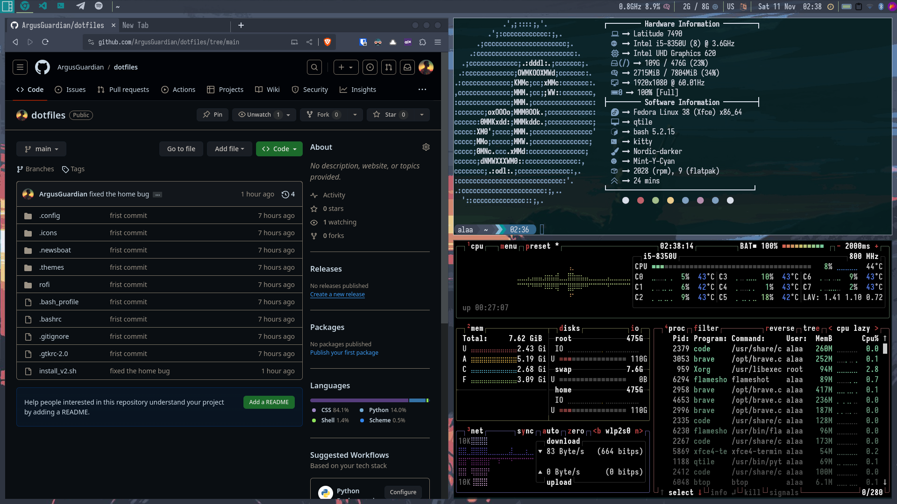
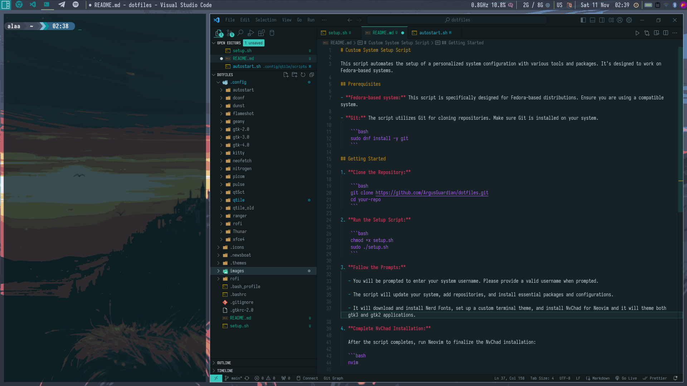
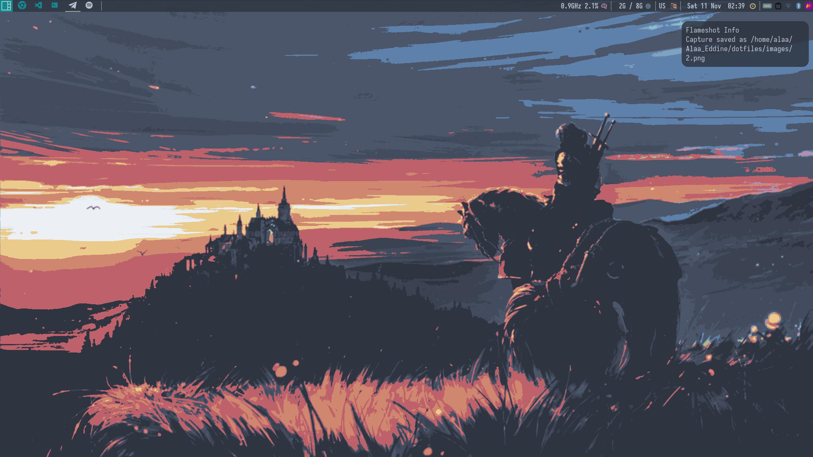
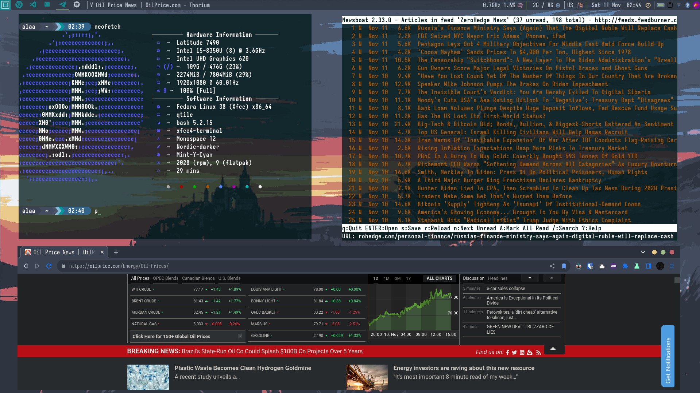

# Custom System Setup Script






This script automates the setup of a personalized system configuration with various tools and packages. It's designed to work on Fedora-based systems.

## Prerequisites

- **Fedora-based system:** This script is specifically designed for Fedora-based distributions. Ensure you are using a compatible system.

- **Git:** The script utilizes Git for cloning repositories. Make sure Git is installed on your system.

    ```bash
    sudo dnf install -y git
    ```

## Getting Started

1. **Clone the Repository:**

    ```bash
    git clone https://github.com/ArgusGuardian/dotfiles.git
    cd your-repo
    ```

2. **Run the Setup Script:**

    ```bash
    chmod +x setup.sh
    sudo ./setup.sh
    ```

3. **Follow the Prompts:**

   - You will be prompted to enter your system username. Please provide a valid username when prompted.

   - The script will update your system, add repositories, and install essential packages and configurations.

   - It will download and install Nerd Fonts, set up a custom terminal theme, and install NvChad for Neovim and it will theme both gtk3 and gtk2 applications.

4. **Complete NvChad Installation:**

   After the script completes, run Neovim to finalize the NvChad installation:

   ```bash
   nvim

## Keybindings

| Key Binding                  | Description                            |
| ---                          | ---                                    |
| **Qtile System Actions**     |                                        |
| Mod + Ctrl + r               | Restart Qtile                          |
| Mod + Ctrl + q               | Shutdown Qtile                         |
| Mod + m                      | Toggle fullscreen for the active window|
| **Active Window Actions**    |                                        |
| Mod + q                      | Kill the active window                  |
| Mod + Ctrl + h / Right       | Increase the size of the active window  |
| Mod + Ctrl + l / Left        | Decrease the size of the active window  |
| Mod + Ctrl + k / Up          | Increase the number of master windows   |
| Mod + Ctrl + j / Down        | Decrease the number of master windows   |
| **Window Focus**             |                                        |
| Mod + Up / Down / Left / Right | Move focus between windows             |
| Mod + k / j / h / l          | Move focus between windows (Vim keys)   |
| **Qtile Layout Actions**     |                                        |
| Mod + r                      | Reset layout to default                 |
| Mod + Tab                    | Switch to the next layout               |
| Mod + Shift + f              | Flip the active layout                  |
| Mod + Shift + Space          | Toggle floating mode for the active window|
| **Move Windows in Layouts**  |                                        |
| Mod + Shift + Up / Down / Left / Right | Move windows within the layout |
| **Change Keyboard Layout**   |                                        |
| Mod4 + Space                 | Switch between keyboard layouts        |
| **Group-Specific Actions**   |                                        |
| Mod + Number                 | Move to the group with the corresponding number|
| Mod1 + Tab                   | Move to the next group                  |
| Mod1 + Shift + Tab           | Move to the previous group              |
| Mod + Ctrl + Number          | Move the active window to the specified group and stay there|
| Mod + Shift + Number         | Move the active window to the specified group and follow it|
| **Scratchpads**              |                                        |
| Mod + t                      | Toggle the terminal scratchpad          |
| Mod + f                      | Toggle the ranger scratchpad            |
| Mod + n                      | Toggle the news scratchpad              |
| Mod + s                      | Toggle the catfish scratchpad           |
| **Other**                    |                                        |
| Mod4 + b                     | Open Thorium Browser                    |
| Mod4 + d                     | Open Discord                            |
| Alt + Enter                  | Open Xfce4 Terminal                     |
| Mod4 + Escape                | Open Xkill                              |
| Ctrl + Shift + s             | Open Flameshot (screenshot tool)        |
| Mod4 + l                     | Lockscreen                              |
| Mod4 + v                     | Open Clipman                            |
| Alt + Escape                 | Open Rofi power menu                    |
| Mod + f                      | Open File Manager                       |
| Alt + p                      | Open Rofi drun                          |
| Alt + w                      | Open Rofi window switcher               |
| Mod + Shift + s              | Reload sxhkd                            |
| Alt + p                      | Open Rofi drun                          |
| Alt + w                      | Open Rofi window switcher               |
| Mod + Shift + s              | Reload sxhkd                            |
| Ctrl + Shift + Escape        | Open Xfce4 Task Manager                 |
| **Multimedia Keys**          |                                        |
| XF86AudioRaiseVolume         | Raise the volume                        |
| XF86AudioLowerVolume         | Lower the volume                        |
| XF86AudioMute                | Mute/unmute audio                       |
